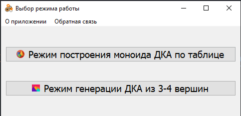
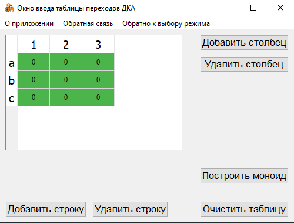
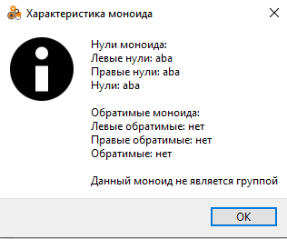
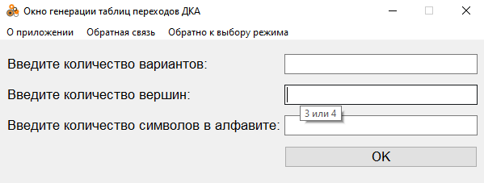
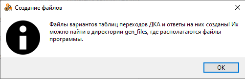
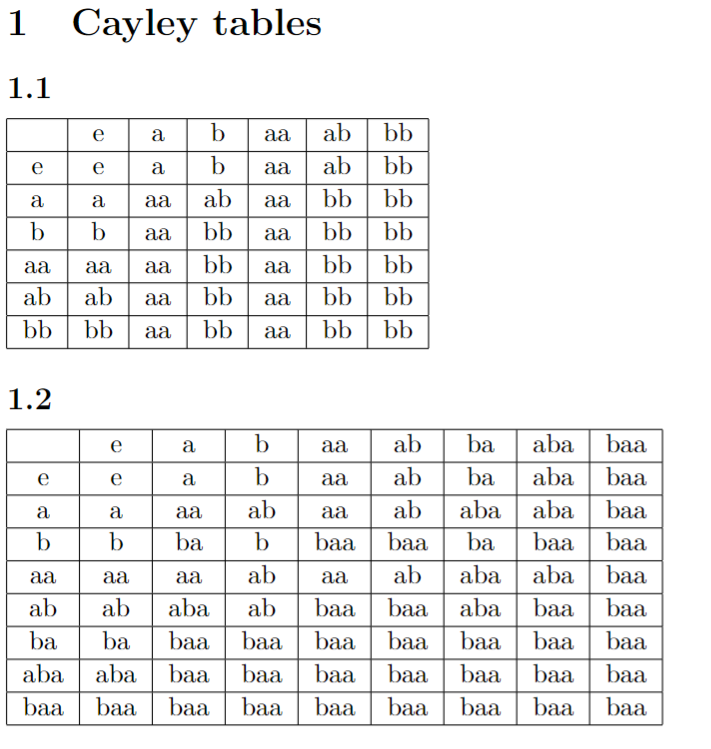

# monoid-auto-app
Данный репозиторий представляет собой учебную практику по теории автоматов на МатМехе УрФу, 
ориентированную на создание программы для построения моноида переходов ДКА, а также таблицы Кэли. 

Кроме того, целью ставилось создание алгоритма для генерации 25-30 случайных таблиц переходов ДКА, на основании 
которых будут создаваться таблицы перехода ДКА по словам и таблицы Кэли в форме PDF-таблиц. 

## Установка
1) Склонировать этот репозиторий:  
`$ git clone https://github.com/tooBusyNow/monoid-auto-app.git`  

2) Открыть директорию *monoid-auto-app* и установить зависимости:  
`$ pip3 install -r .\requirements.txt`  

3) Скачать и установить на систему MiKTeX с [официального сайта](https://miktex.org/download)  

## Запуск и использование
Находясь в директории *monoid-auto-app*, прописать в терминале:  
`$ python .\src\run.py`

После чего откроется окно выбора режима:

Как уже было сказано, программа поддерживает 2 режима работы: ручной ввод ДКА через таблицу, либо генерация 25-30 таблиц переходов ДКА, на основе которых составляются таблицы моноидов и таблицы Кэли.

Окно ручного ввода таблицы выглядит следующим образом:

Размер таблицы можно регулировать, однако в рамках проекта он должен быть в рамках от 2x2 до 5x3. На практике, это ограничение является полностью искусственным - таблицу можно расширять бесконечно. Так что при необходимости можно написать разработчиками и попросить внести изменения.  

К слову, сделать это несложно:

## Пример ручного ввода:

Рассмотрим это для примера, взятого [отсюда, c. 27](http://kadm.kmath.ru/files/lectures_volkov.pdf). Изменяем размеры таблицы и вводим значения, после чего сразу же открывается окно с демонстрацией построенных таблиц моноида и Кэли: 

Отдельно можно посмотреть всю и характеристику для построенного моноида:

## Пример ручного ввода:

Теперь перейдем к рассмотрению второго режима работы - режима генерации таблиц ДКА и соответствующих им таблиц переходов ДКА по словам и таблиц Кэли. Чтобы перейти к этому режиму - можно даже не перезапускать приложение, а просто нажать _"Обратно к выбору режима"_, увидим вот такое окно:

Если навестись мышью на каждое поле - можно увидеть, какие значения ввода мы ожидаем от пользователя. Опять же, изменить эти в ограничения при необходимости не представляет никакой сложности.

 

Однако вернемся к нашему примеру. Пусть мы хотим построить 30 вариантов различных таблиц переходов ДКА из 4 вершин и алфавитом из 2 символов, выставляем соответствующие значения и жмём _"ОК"_, через какое-то время получим сообщение об успешной генерации:

После этого можно [перейти в директорию gen_files](./gen_files/) и посмотреть результаты построения.  
Вот небольшое превью:

